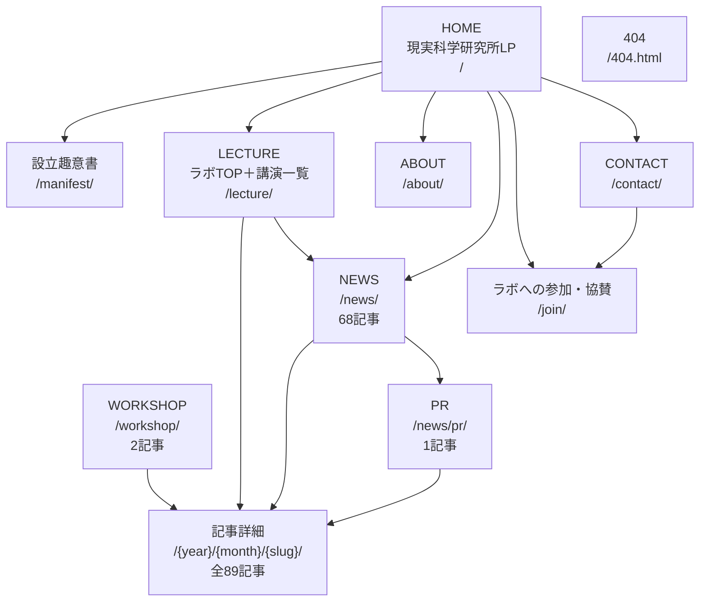

# 現実科学研究所／現実科学ラボ サイトマップ

現実科学研究所LPをHOMEに置き、現実科学ラボの既存TOPとLECTURE一覧を `/lecture/` に統合する整理案です。既存コンテンツの移動・統合のみを行い、新規ページや新規コンテンツは追加しません。

現在は本番ルートを変更せず、確認用として全URLの先頭に `/sample` を付けて公開します。たとえば、この文書の `/` は `https://reality-science.com/sample/`、`/lecture/` は `https://reality-science.com/sample/lecture/` に対応します。確認用ページには検索除外指定を入れますが、URLを知る人は閲覧できます。

## グローバルナビゲーション

| 表示名 | URL | 備考 |
|---|---|---|
| HOME | `/` | 現実科学研究所LP |
| LECTURE | `/lecture/` | 現実科学ラボTOPと講演一覧を統合 |
| ABOUT | `/about/` | ラボ紹介 |
| NEWS | `/news/` | ニュース一覧 |
| JOIN | `/join/` | ラボへの参加・協賛 |
| CONTACT | `/contact/` | お問い合わせ |

## その他の公開ルート

| ページ種別 | URL | 掲載数 | グローバルナビ |
|---|---|---:|---|
| 設立趣意書 | `/manifest/` | — | HOMEから遷移 |
| WORKSHOP一覧 | `/workshop/` | 2記事 | なし |
| PR一覧 | `/news/pr/` | 1記事 | NEWS配下 |
| 記事詳細 | `/{year}/{month}/{slug}/` | 89記事 | LECTURE・NEWS等から遷移 |
| 404 | `/404.html` | — | システムページ |

> 記事は複数カテゴリに所属できるため、各一覧の掲載数の合計は全記事数と一致しません。

## URL移行（本番切り替え時の想定）

- `/institute/lp/` → `/`
- `/institute/lp/manifest/` → `/manifest/`
- `/event/` → `/lecture/`

確認公開中は既存の本番URLを変更せず、`/sample/event/` のみ `/sample/lecture/` へ転送します。本番切り替え時には旧URLに同一内容を残さず、新URLへ転送します。

## 非公開として扱うもの

以下は制作資料・ソース・過去案であり、公開サイトのサイトマップには含めません。

- `institute/apps/lp/` の旧LP
- `institute/apps/lp/v1/`〜`v6/` のデザイン案
- `institute/apps/lp/v7/` のソース一式（内容は `/` と `/manifest/` に配置）
- `institute/docs/` の企画書、デザイン資料、プレスリリース草稿、PDF
- `institute/docs/_archive/` の過去資料
- `_mirror/`、`src/mirror/` の移行・テンプレート用HTML
- `docs/` の運用・開発ドキュメント

## URL・内容一覧

以下は、整理後に公開するページです。グローバルナビゲーションやHOMEから直接リンクされていない既存公開ページも含みます。

### 基本ページ

- `/` — **HOME／現実科学研究所LP**。「現実は、編集できる。」を軸に、研究所の考え方、ミッション、プロジェクト、行動指針、参画案内を掲載。
- `/manifest/` — **現実科学研究所 設立趣意書**。研究所の設立背景、問題意識、目的、研究・実践の方向性を掲載。
- `/lecture/` — **LECTURE**。現在の現実科学ラボTOPとLECTURE一覧を統合。ヒーロー、NEXT LECTURE、NEWS、過去のレクチャー一覧で構成。
- `/about/` — **ABOUT**。現実科学ラボの目的や活動方針を紹介するページ。
- `/contact/` — **CONTACT**。ラボへの問い合わせ窓口。現状は静的サイトのため、フォーム送信機能には別途バックエンドが必要。
- `/join/` — **ラボへの参加・協賛**。参加、協賛、連携を検討する人・組織向けの案内。
- `/news/` — **NEWS**。ニュースカテゴリの記事一覧。68記事。
- `/workshop/` — **WORKSHOP**。ワークショップ記事の一覧。2記事。グローバルナビゲーションには未掲載。
- `/news/pr/` — **PR**。プレスリリース記事の一覧。1記事。グローバルナビゲーションには未掲載。
- `/404.html` — **404**。存在しないURLへアクセスした場合のエラーページ。

### 記事詳細（89ページ）

記事詳細は公開日とスラッグから `/{年}/{月}/{スラッグ}/` の形式で生成されます。

#### 2026年

- `/2026/07/vol-75/` — Vol.75 川田十夢さんレクチャー（2026/9/29開催）
- `/2026/07/vol-74/` — Vol.74 田中悠斗さんレクチャー（2026/8/21開催）
- `/2026/04/vol-73/` — Vol.73 小山 順一朗さんレクチャー（2026/7/28開催）
- `/2026/03/vol-72/` — Vol.72 藤野 正寛さんレクチャー（2026/6/26開催）
- `/2026/03/vol-71/` — Vol.71 福岡 俊弘さんレクチャー（2026/5/26開催）
- `/2026/02/vol-70/` — Vol.70 岩瀬 大輔さんレクチャー（2026/4/21開催）

#### 2025年

- `/2025/12/vol-69/` — Vol.69 佐渡島 庸平さんレクチャー（2026/3/24開催）
- `/2025/10/vol-68/` — Vol.68 中村伊知哉さんレクチャー（2026/2/27開催）
- `/2025/10/vol-67/` — Vol.67 渡邊淳司さんレクチャー（2026/1/23開催）
- `/2025/08/vol-66/` — Vol.66 林信行さんレクチャー（2025/12/19開催）
- `/2025/08/vol-65/` — Vol.65 上田洋子さんレクチャー（2025/11/21開催）
- `/2025/05/vol-64/` — Vol.64 吉田真明さんレクチャー（2025/10/22開催）
- `/2025/05/vol-63/` — Vol.63 畠中実さんレクチャー（2025/9/26開催）
- `/2025/04/vol-62/` — Vol.62 松波龍源さんレクチャー（2025/8/25開催）
- `/2025/04/vol-61/` — Vol.61 佐藤航陽さんレクチャー（2025/7/29開催）
- `/2025/04/vol-60/` — Vol.60 せきぐちあいみさんレクチャー（2025/6/24開催）
- `/2025/03/vol-59/` — Vol.59 筧康明さんレクチャー（2025/5/23開催）
- `/2025/02/vol-58/` — Vol.58 谷口忠大さんレクチャー（2025/4/28開催）

#### 2024年

- `/2024/12/vol-57/` — Vol.57 奥野克巳さんレクチャー（2025/3/27開催）
- `/2024/11/vol-56/` — Vol.56 柳澤田実さんレクチャー（2025/2/21開催）
- `/2024/11/vol-55/` — Vol.55 西郷甲矢人さんレクチャー（2025/1/31開催）
- `/2024/11/ex-02/` — 映画『本心』コラボレクチャー（期間限定公開）
- `/2024/09/vol-54/` — Vol.54 渡邉英徳さんレクチャー（2024/12/16開催）
- `/2024/09/vol-53/` — Vol.53 山口征浩さんレクチャー（2024/11/11開催）
- `/2024/07/vol-52/` — Vol.52 橋本昌嗣さんレクチャー（2024/10/30開催）
- `/2024/06/vol-51/` — Vol.51 稲田俊輔さんレクチャー（2024/9/27開催）
- `/2024/05/vol-50/` — Vol.50 七沢智樹さんレクチャー（2024/8/27開催）
- `/2024/05/vol-49/` — Vol.49 田口茂さんレクチャー（2024/7/29開催）
- `/2024/04/vol-48/` — Vol.48 須藤海さんレクチャー（2024/6/25開催）
- `/2024/03/vol-47/` — Vol.47 三浦亜美さんレクチャー（2024/5/31開催）
- `/2024/03/vol-46/` — Vol.46 相馬千秋さん・宮原裕美さんレクチャー（2024/4/19開催）

#### 2023年

- `/2023/12/vol-45/` — Vol.45 松本紹圭さんレクチャー（2024/3/22開催）
- `/2023/12/vol-44/` — Vol.44 徳井直生さんレクチャー（2024/2/28開催）
- `/2023/11/vol-43/` — Vol.43 小林秀章さんレクチャー（2024/1/31開催）
- `/2023/10/vol-42/` — Vol.42 吉富愛望アビガイル先生レクチャー（2023/12/15開催）
- `/2023/09/vol-41/` — Vol.41 樋口真嗣先生レクチャー（2023/11/20開催）
- `/2023/08/vol-40/` — Vol.40 北岡明佳先生レクチャー（2023/10/31開催）
- `/2023/08/vol-39/` — Vol.39 山中俊治先生レクチャー（2023/9/22開催）
- `/2023/05/vol-38/` — Vol.38 松島倫明先生レクチャー（2023/8/30開催）
- `/2023/05/vol-37/` — Vol.37 『現実とは？――脳と意識とテクノロジーの未来』出版記念レクチャー（2023/7/14開催）
- `/2023/03/vol-36/` — Vol.36 平野啓一郎先生レクチャー（2023/6/29開催）
- `/2023/03/vol-35/` — Vol.35 上出遼平先生レクチャー（2023/5/12開催）
- `/2023/02/vol-34/` — Vol.34 塚田有那先生レクチャー（2023/4/24開催）

#### 2022年

- `/2022/12/vol-33/` — Vol.33 藤原麻里菜先生レクチャー（2023/3/23開催）
- `/2022/12/vol-32/` — Vol.32 菅野志桜里先生レクチャー（2023/2/28開催）
- `/2022/12/vol-31/` — Vol.31 宮下芳明先生レクチャー（2023/1/17開催）
- `/2022/10/vol-30/` — Vol.30 鈴木健先生レクチャー（2022/12/19開催）
- `/2022/07/vol-29/` — Vol.29 為末大先生レクチャー（2022/11/21開催）
- `/2022/06/vol-28/` — Vol.28 落合陽一先生レクチャー（2022/10/24開催）
- `/2022/05/vol-27/` — Vol.27 四方幸子先生レクチャー（2022/9/30開催）
- `/2022/05/vol-26/` — Vol.26 谷川じゅんじ先生レクチャー（2022/8/26開催）
- `/2022/05/vol-25/` — Vol.25 長谷川眞理子先生レクチャー（2022/7/25開催）
- `/2022/04/ex-01/` — 『脳と生きる』出版記念鼎談（2022/7/12開催）
- `/2022/04/vol-24/` — Vol.24 布施英利先生レクチャー（2022/6/30開催）
- `/2022/04/vol-23/` — Vol.23 伊藤亜紗先生レクチャー（2022/5/20開催）
- `/2022/03/vol-22/` — Vol.22 北川拓也先生レクチャー（2022/4/19開催）
- `/2022/01/vol-21/` — Vol.21 豊田啓介先生レクチャー（2022/3/17開催）

#### 2021年

- `/2021/12/vol-20/` — Vol.20 杉山知之先生レクチャー（2022/1/28開催）
- `/2021/11/dhu-open-lecture/` — 「現実科学ラボ レクチャーシリーズ」がデジタルハリウッド大学の公開講座に
- `/2021/11/vol-19/` — Vol.19 小御門先生・水落先生レクチャー（2021/12/20開催）
- `/2021/10/vol-18/` — Vol.18 杉山知之先生レクチャー（2021/11/30開催）
- `/2021/09/vol-17/` — Vol.17 長沼毅先生レクチャー（2021/10/20開催）
- `/2021/08/vol-16_torishima/` — Vol.16 酉島伝法先生レクチャー（2021/9/24開催）
- `/2021/08/vol-15_hasegawa/` — Vol.15 長谷川愛先生レクチャー（2021/8/18開催）
- `/2021/07/vol-14_mori/` — Vol.14 森達也先生レクチャー（2021/7/21開催）
- `/2021/06/vol-13_yasuda/` — Vol.13 安田登先生レクチャー（2021/6/21開催）
- `/2021/06/vol-12_kato/` — Vol.12 加藤直人先生レクチャー（2021/5/20開催）
- `/2021/06/vol-11_imai/` — Vol.11 今井むつみ先生レクチャー（2021/4/20開催）
- `/2021/04/vol-10_saito/` — Vol.10 斎藤環先生レクチャー（2021/3/22開催）
- `/2021/04/vol-09_fukuhara/` — Vol.9 福原志保先生レクチャー（2021/2/22開催）
- `/2021/02/vol-08_rekimoto/` — Vol.8 暦本純一先生レクチャー（2021/1/21開催）
- `/2021/02/vol-07_yoro/` — Vol.7 養老孟司先生レクチャー（2020/12/12開催）
- `/2021/01/vol-06_toyoda/` — Vol.6 豊田啓介先生レクチャー（2020/11/24開催）

#### 2020年

- `/2020/12/vol-05_sakaguchi/` — Vol.5 坂口恭平先生レクチャー（2020/10/20開催）
- `/2020/11/vol-04_ichihara/` — Vol.4 市原えつこ先生レクチャー（2020/9/30開催）
- `/2020/10/20201212_takeshiyourou/` — Vol.7 養老孟司先生レクチャー（2020/12/12開催）
- `/2020/10/20201124_keisuketoyota/` — 2020/11/24 レクチャーシリーズ Vol.6 豊田啓介先生
- `/2020/10/20201020_kyoheisakaguchi/` — 2020/10/20 レクチャーシリーズ Vol.5 坂口恭平氏
- `/2020/09/20200920_etsukoichihara/` — 2020/9/30 レクチャーシリーズ Vol.4 市原えつこ氏
- `/2020/09/vol-03_tom/` — Vol.3 川田十夢先生レクチャー（2020/8/20開催）
- `/2020/08/vol-02_goroman/` — Vol.2 GOROman先生レクチャー（2020/7/27開催）
- `/2020/07/vol-01_inami/` — Vol.1 稲見昌彦先生レクチャー（2020/6/22開催）
- `/2020/07/%e7%8f%be%e5%ae%9f%e7%a7%91%e5%ad%a6%e3%83%a9%e3%83%9c%e3%83%ac%e3%82%af%e3%83%81%e3%83%a3%e3%83%bc%e3%82%b7%e3%83%aa%e3%83%bc%e3%82%ba-vol-3/` — 2020/8/20 レクチャーシリーズ Vol.3 川田十夢先生
- `/2020/07/%e7%8f%be%e5%ae%9f%e7%a7%91%e5%ad%a6%e3%83%a9%e3%83%9c%e3%83%ac%e3%82%af%e3%83%81%e3%83%a3%e3%83%bc%e3%82%b7%e3%83%aa%e3%83%bc%e3%82%ba-vol-2/` — 2020/7/27 レクチャーシリーズ Vol.2 GOROman先生
- `/2020/06/lecture_series/` — 現実科学ラボレクチャーシリーズ 開催決定
- `/2020/03/workshop-202002/` — 現実ナイト ワークショップ 2020年2月
- `/2020/01/workshop-202001/` — 現実ナイト ワークショップ 2020年1月
- `/2020/01/hello-world/` — 現実科学ラボ キックオフ
- `/2020/01/brainmusic/` — BrainMusic：実験参加のおねがい
